# Build an AI Habit Forensics Lab

> Inside the [Applied Frameworks Systems Engineering](../../README.md) portfolio · *Frameworks from books and methodologies, engineered into working systems.*

## Overview

-T-h-i-s- -p-r-o-j-e-c-t- -b-u-i-l-d-s- -a- -s-t-r-u-c-t-u-r-e-d- -d-i-a-g-n-o-s-t-i-c- -s-y-s-t-e-m- -f-o-r- -a-n-a-l-y-z-i-n-g- -a-n-d- -r-e-p-a-i-r-i-n-g- -f-a-i-l-i-n-g- -h-a-b-i-t-s- -u-s-i-n-g- -a- -c-u-s-t-o-m- -A-I- -C-o-a-c-h- -p-e-r-s-o-n-a- -a-n-d- -p-e-r-s-i-s-t-e-n-t- -a-r-t-i-f-a-c-t-s-.-
-
-T-h-e- -s-y-s-t-e-m- -s-h-i-f-t-s- -h-a-b-i-t- -t-r-a-c-k-i-n-g- -f-r-o-m- -s-u-r-f-a-c-e---l-e-v-e-l- -l-o-g-g-i-n-g- -t-o- -r-o-o-t---c-a-u-s-e- -a-n-a-l-y-s-i-s-.- -I-n-s-t-e-a-d- -o-f- -m-e-a-s-u-r-i-n-g- -s-t-r-e-a-k-s- -o-r- -o-u-t-c-o-m-e-s-,- -i-t- -i-d-e-n-t-i-f-i-e-s- -s-t-r-u-c-t-u-r-a-l- -f-a-i-l-u-r-e- -p-o-i-n-t-s- -a-c-r-o-s-s- -t-h-e- -h-a-b-i-t- -l-o-o-p- -a-n-d- -a-p-p-l-i-e-s- -t-a-r-g-e-t-e-d- -i-n-t-e-r-v-e-n-t-i-o-n-s-.- -T-h-e- -r-e-s-u-l-t- -i-s- -a- -r-e-u-s-a-b-l-e- -f-r-a-m-e-w-o-r-k- -t-h-a-t- -c-a-n- -d-i-a-g-n-o-s-e- -a-n-y- -h-a-b-i-t- -f-a-i-l-u-r-e- -a-n-d- -p-r-o-d-u-c-e- -c-o-r-r-e-c-t-i-v-e- -s-t-r-a-t-e-g-i-e-s- -g-r-o-u-n-d-e-d- -i-n- -b-e-h-a-v-i-o-r-a-l- -m-e-c-h-a-n-i-c-s- -r-a-t-h-e-r- -t-h-a-n- -m-o-t-i-v-a-t-i-o-n-.-

The architecture is built across **7 phases**, anchored by **Building an AI-Powered Habit Forensics Lab** on the input side and **The Teach-Back Challenge** at the end. Each phase is listed in the Implementation section below.

## Architecture

```mermaid
---
title: Build an AI Habit Forensics Lab
---
%%{init: {"theme":"base","themeVariables": {"primaryColor":"#1B4332","primaryTextColor":"#F4D03F","primaryBorderColor":"#F4D03F","secondaryColor":"#264653","tertiaryColor":"#2F5233","lineColor":"#F4D03F","fontFamily":"ui-monospace, SFMono-Regular, Menlo, Consolas, monospace","fontSize":"13px"}}}%%
flowchart LR
    classDef datastore fill:#264653,stroke:#F4D03F,stroke-width:2px,color:#FFFFFF
    classDef service fill:#1B4332,stroke:#F4D03F,stroke-width:2px,color:#F4D03F
    classDef event fill:#7B42BC,stroke:#F4D03F,stroke-width:2px,color:#FFFFFF
    classDef io fill:#0d1117,stroke:#F4D03F,stroke-width:1.5px,color:#F4D03F,font-style:italic







    User[/Habit Attempt/] --> Cue

    subgraph HabitLoop["Atomic Habits Loop (as code)"]
        direction LR
        Cue(Cue Detector) -->|triggers| Craving(Craving Evaluator)
        Craving -->|drives| Response(Response Executor)
        Response -->|yields| Reward(Reward Reinforcer)
        Reward -.->|reinforces| Cue
    end

    Response -->|logs| HabitLog[(Obsidian Vault: Habit Logs)]
    Reward -->|logs| HabitLog

    subgraph ForensicsLayer["Forensics Layer (Coach Persona)"]
        direction TB
        PastSelf(Past-Self-as-Pattern) -->|detects break| FourLaws(Four Laws Diagnostic)
        FourLaws -->|scores| Autopsy{{Habit Autopsy Event}}
        IdentityFuture(Identity Future Voice) -->|reframes| HabitOS(Habit OS Repair)
        Autopsy -->|alerts| HabitOS
    end

    HabitLog -->|feeds history| PastSelf
    HabitOS -->|patches| Cue
    HabitOS -->|patches| Response

    subgraph Reinforcement["30-Day Re-Score Loop"]
        ReScore(30-Day Re-Score Engine) -->|measures| Metrics[/Frequency + Identity Alignment/]
        Metrics -->|fail| Autopsy
    end

    HabitLog -->|streams| ReScore
    HabitOS -->|publishes| Diagram[/Mermaid Habit-Loop Artifact/]
    class Cue,PastSelf,IdentityFuture,ReScore service
    class User io
```

The diagram shows the topology and data flow of the system as built. The full architectural narrative, with screenshots and prose, lives in [`documents/ai-habit-forensics-lab.md`](./documents/ai-habit-forensics-lab.md).

## Implementation

This system is built across **7 phases**:

1. **Building an AI-Powered Habit Forensics Lab**
2. **Designing the Coach Persona**, -.
3. **Running the Habit Autopsy**
4. **Diagnosing the Four Laws of Behavior Change**
5. **Crafting an Identity Reframe and Habit Operating System**
6. **Visualizing the Habit Loop and Setting the 30-Day Re-Score**
7. **The Teach-Back Challenge**, -.

For the full walkthrough with screenshots and step-by-step content, see [`documents/ai-habit-forensics-lab.md`](./documents/ai-habit-forensics-lab.md).

## Validation

Build outcomes verified end-to-end. Each phase below is captured with screenshots, configuration, and observable behavior in [`documents/ai-habit-forensics-lab.md`](./documents/ai-habit-forensics-lab.md):

- ✅ Building an AI-Powered Habit Forensics Lab
- ✅ Designing the Coach Persona
- ✅ Running the Habit Autopsy
- ✅ Diagnosing the Four Laws of Behavior Change
- ✅ Crafting an Identity Reframe and Habit Operating System
- ✅ Visualizing the Habit Loop and Setting the 30-Day Re-Score
- ✅ The Teach-Back Challenge
