# Build an AI Habit Forensics Lab

> Inside the [Applied Frameworks Systems Engineering](../../README.md) portfolio · *Frameworks from books and methodologies, engineered into working systems.*

## Overview

This project builds a structured diagnostic system for analyzing and repairing failing habits using a custom AI Coach persona and persistent artifacts.

The system shifts habit tracking from surface-level logging to root-cause analysis. Instead of measuring streaks or outcomes, it identifies structural failure points across the habit loop and applies targeted interventions. The result is a reusable framework that can diagnose any habit failure and produce corrective strategies grounded in behavioral mechanics rather than motivation.

The architecture is built across **7 phases**, anchored by **Building an AI-Powered Habit Forensics Lab** on the input side and **The Teach-Back Challenge** at the end. Each phase is listed in the Implementation section below.

## Architecture

```mermaid
---
title: Build an AI Habit Forensics Lab
---
%%{init: {"theme":"base","themeVariables": {"primaryColor":"#1B4332","primaryTextColor":"#F4D03F","primaryBorderColor":"#F4D03F","secondaryColor":"#264653","tertiaryColor":"#2F5233","lineColor":"#F4D03F","fontFamily":"ui-monospace, SFMono-Regular, Menlo, Consolas, monospace","fontSize":"13px"}}}%%
flowchart LR
    classDef datastore fill:#264653,stroke:#F4D03F,stroke-width:2px,color:#FFFFFF
    classDef service fill:#1B4332,stroke:#F4D03F,stroke-width:2px,color:#F4D03F
    classDef event fill:#7B42BC,stroke:#F4D03F,stroke-width:2px,color:#FFFFFF
    classDef io fill:#0d1117,stroke:#F4D03F,stroke-width:1.5px,color:#F4D03F,font-style:italic







    User[/Habit Attempt/] --> Cue

    subgraph HabitLoop["Atomic Habits Loop (as code)"]
        direction LR
        Cue(Cue Detector) -->|triggers| Craving(Craving Evaluator)
        Craving -->|drives| Response(Response Executor)
        Response -->|yields| Reward(Reward Reinforcer)
        Reward -.->|reinforces| Cue
    end

    Response -->|logs| HabitLog[(Obsidian Vault: Habit Logs)]
    Reward -->|logs| HabitLog

    subgraph ForensicsLayer["Forensics Layer (Coach Persona)"]
        direction TB
        PastSelf(Past-Self-as-Pattern) -->|detects break| FourLaws(Four Laws Diagnostic)
        FourLaws -->|scores| Autopsy{{Habit Autopsy Event}}
        IdentityFuture(Identity Future Voice) -->|reframes| HabitOS(Habit OS Repair)
        Autopsy -->|alerts| HabitOS
    end

    HabitLog -->|feeds history| PastSelf
    HabitOS -->|patches| Cue
    HabitOS -->|patches| Response

    subgraph Reinforcement["30-Day Re-Score Loop"]
        ReScore(30-Day Re-Score Engine) -->|measures| Metrics[/Frequency + Identity Alignment/]
        Metrics -->|fail| Autopsy
    end

    HabitLog -->|streams| ReScore
    HabitOS -->|publishes| Diagram[/Mermaid Habit-Loop Artifact/]
    class Cue,PastSelf,IdentityFuture,ReScore service
    class User io
```

The diagram shows the topology and data flow of the system as built. The full architectural narrative, with screenshots and prose, lives in [`documents/ai-habit-forensics-lab.md`](./documents/ai-habit-forensics-lab.md).

## Implementation

This system is built across **7 phases**:

1. **Building an AI-Powered Habit Forensics Lab**
2. **Designing the Coach Persona**
3. **Running the Habit Autopsy**
4. **Diagnosing the Four Laws of Behavior Change**
5. **Crafting an Identity Reframe and Habit Operating System**
6. **Visualizing the Habit Loop and Setting the 30-Day Re-Score**
7. **The Teach-Back Challenge**

For the full walkthrough with screenshots and step-by-step content, see [`documents/ai-habit-forensics-lab.md`](./documents/ai-habit-forensics-lab.md).

## Validation

Each build phase below is documented in [`documents/ai-habit-forensics-lab.md`](./documents/ai-habit-forensics-lab.md), with screenshots, configuration, and notes as captured during the build:

- ✅ Building an AI-Powered Habit Forensics Lab
- ✅ Designing the Coach Persona
- ✅ Running the Habit Autopsy
- ✅ Diagnosing the Four Laws of Behavior Change
- ✅ Crafting an Identity Reframe and Habit Operating System
- ✅ Visualizing the Habit Loop and Setting the 30-Day Re-Score
- ✅ The Teach-Back Challenge
