# Build an AI Health Scorecard System

> Inside the [Applied Frameworks Systems Engineering](../../README.md) portfolio · *Frameworks from books and methodologies, engineered into working systems.*

## Overview

In this project, I built an AI-powered personal health assessment system modeled after the longevity framework discussed in Outlive. The goal was to create a proactive system for understanding long-term health trajectory instead of reacting only after visible health decline appears.

The platform combined Claude Code, Obsidian, Mermaid diagrams, Fitbit telemetry, and multi-agent scoring workflows into a unified assessment pipeline. The system focused on prevention, longitudinal tracking, behavioral calibration, and actionable health optimization instead of generic wellness tracking.

The architecture is built across **9 phases**, anchored by **Building a Personal AI Health Assessment System** on the input side and **Building the Biological Age Clock** at the end. Each phase is listed in the Implementation section below.

## Architecture

```mermaid
---
title: Build an AI Health Scorecard System
---
%%{init: {"theme":"base","themeVariables": {"primaryColor":"#1B4332","primaryTextColor":"#F4D03F","primaryBorderColor":"#F4D03F","secondaryColor":"#264653","tertiaryColor":"#2F5233","lineColor":"#F4D03F","fontFamily":"ui-monospace, SFMono-Regular, Menlo, Consolas, monospace","fontSize":"13px"}}}%%
flowchart LR
    classDef datastore fill:#264653,stroke:#F4D03F,stroke-width:2px,color:#FFFFFF
    classDef service fill:#1B4332,stroke:#F4D03F,stroke-width:2px,color:#F4D03F
    classDef event fill:#7B42BC,stroke:#F4D03F,stroke-width:2px,color:#FFFFFF
    classDef io fill:#0d1117,stroke:#F4D03F,stroke-width:1.5px,color:#F4D03F,font-style:italic

    subgraph Env["Local-First Environment"]
        ClaudeCode(Claude Code)
        Obsidian(Obsidian Vault)
        Mermaid(Mermaid Live Editor)
        Folders[(Prompts + Scores + Exports + Dashboards)]
    end

    subgraph VA["Vision Anchor"]
        FiveCaps[(5 Capabilities at Age 90)]
        FutureMap(Capability-to-Domain Mapping)
        Tiebreak(Vision-Anchor Tiebreaker)
    end

    subgraph Inputs["Physical and Wearable Inputs"]
        Fitbit[/Fitbit Telemetry: HRV + VO2 + Sleep + Steps/]
        Balance[/Balance Test/]
        Grip[/Grip Strength/]
        Mobility[/Mobility Score/]
        DeadHang[/Dead-Hang Endurance/]
        Body[/Body Measurements + Waist/]
        SelfReport[/Self-Reported Behaviors/]
    end

    subgraph Pipeline["Six-Agent Assessment Pipeline"]
        Intake(Intake Interviewer)
        IntakeModules[(5 Assessment Modules + Predict-then-Reveal)]
        Escalation{{Emergency Escalation Handler}}
        Integrator(Data Integrator)
        CrossVal(Cross-Validation: telemetry vs self-report)
        Scoring(Scoring Engine)
        DomainScores[(Domain Scores + Confidence)]
        Protocol(Protocol Architect)
        PriorityStack[(Priority Stack: highest-leverage actions)]
        Pressure(Pressure Tester)
        Skeptic{{Skeptic Persona}}
        FutureSelf75{{Future Self at 75 Persona}}
    end

    subgraph Confidence["Source-Quality Indicator System"]
        Green(Green: Measured Telemetry)
        Amber(Amber: Validated Estimate)
        Gray(Gray: Missing or Contradictory)
    end

    subgraph Dashboard["Interactive Decision-Support Dashboard"]
        Radar(Radar Chart)
        Trajectory(Trajectory Projections)
        Quarterly(Quarterly Comparison View)
        Upgrade(Data Upgrade Path)
        DashHTML[(Local HTML Dashboard)]
    end

    subgraph Continuity["Reviews + Re-runs Continuity Layer"]
        AAR(After Action Review)
        Weekly(Weekly Check-ins)
        QuarterRerun(Quarterly Re-run Protocol)
        AntiDrift(Anti-Drift Re-anchoring)
    end

    subgraph BioClock["Secret Mission: Biological Age Clock"]
        Cardio(Cardiorespiratory)
        Metabolic(Metabolic)
        Sleep(Sleep)
        Strength(Strength)
        Nutrition(Nutrition)
        BioDelta[(Composite Bio-Age Delta vs Chronological)]
    end

    ClaudeCode --> Obsidian
    Obsidian --> Folders
    Mermaid -.architecture viz.-> Pipeline

    FiveCaps --> FutureMap
    FutureMap --> Tiebreak
    Tiebreak -.applied during ties.-> PriorityStack

    Fitbit --> Integrator
    Balance --> Integrator
    Grip --> Integrator
    Mobility --> Integrator
    DeadHang --> Integrator
    Body --> Integrator
    SelfReport --> Intake

    Intake --> IntakeModules
    IntakeModules --> Integrator
    Intake -.high-risk responses.-> Escalation
    Integrator --> CrossVal
    CrossVal --> Scoring
    Scoring --> DomainScores
    DomainScores --> Protocol
    Protocol --> PriorityStack
    PriorityStack --> Pressure
    Pressure --> Skeptic
    Pressure --> FutureSelf75
    Skeptic -.audits data reliability.-> CrossVal
    FutureSelf75 -.audits long-term adequacy.-> Protocol

    DomainScores --> Green
    DomainScores --> Amber
    DomainScores --> Gray

    PriorityStack --> Radar
    DomainScores --> Radar
    DomainScores --> Trajectory
    Trajectory --> Quarterly
    Quarterly --> Upgrade
    Radar --> DashHTML
    Trajectory --> DashHTML
    Quarterly --> DashHTML
    Green -.evidence weighting.-> DashHTML
    Amber -.evidence weighting.-> DashHTML
    Gray -.evidence weighting.-> DashHTML

    DashHTML --> AAR
    AAR --> Weekly
    Weekly --> QuarterRerun
    QuarterRerun --> AntiDrift
    AntiDrift -.re-anchors.-> FiveCaps

    Cardio --> BioDelta
    Metabolic --> BioDelta
    Sleep --> BioDelta
    Strength --> BioDelta
    Nutrition --> BioDelta
    BioDelta -.maps to.-> FutureMap
    class ClaudeCode,Obsidian,Mermaid io
    class Intake,Integrator,Scoring,Protocol,Pressure,Skeptic,FutureSelf75 service
    class Radar,Trajectory,Quarterly,Upgrade,AAR,Weekly,QuarterRerun,AntiDrift service
    class Cardio,Metabolic,Sleep,Strength,Nutrition service
    class CrossVal,Tiebreak,Green,Amber,Gray service
    class Folders,IntakeModules,DomainScores,PriorityStack,DashHTML,BioDelta,FiveCaps,FutureMap datastore
    class Fitbit,Balance,Grip,Mobility,DeadHang,Body,SelfReport io
    class Escalation event
```

The diagram shows the topology and data flow of the system as built. The full architectural narrative, with screenshots and prose, lives in [`documents/ai-health-scorecard-system.md`](./documents/ai-health-scorecard-system.md).

## Implementation

This system is built across **9 phases**:

1. **Building a Personal AI Health Assessment System**
2. **Setting Up the Project Environment**
3. **Defining the Vision Anchor and Pipeline Architecture**
4. **Building the Conversational Assessment Engine**
5. **Building the Scoring Engine and Protocol Generator**
6. **Running the First Full Assessment**
7. **Building the Interactive Dashboard**
8. **Establishing Reviews, Check-ins, and Quarterly Re-runs**
9. **Building the Biological Age Clock**

For the full walkthrough with screenshots and step-by-step content, see [`documents/ai-health-scorecard-system.md`](./documents/ai-health-scorecard-system.md).

## Validation

Each build phase below is documented in [`documents/ai-health-scorecard-system.md`](./documents/ai-health-scorecard-system.md), with screenshots, configuration, and notes as captured during the build:

- ✅ Building a Personal AI Health Assessment System
- ✅ Setting Up the Project Environment
- ✅ Defining the Vision Anchor and Pipeline Architecture
- ✅ Building the Conversational Assessment Engine
- ✅ Building the Scoring Engine and Protocol Generator
- ✅ Running the First Full Assessment
- ✅ Building the Interactive Dashboard
- ✅ Establishing Reviews, Check-ins, and Quarterly Re-runs
- ✅ Building the Biological Age Clock
