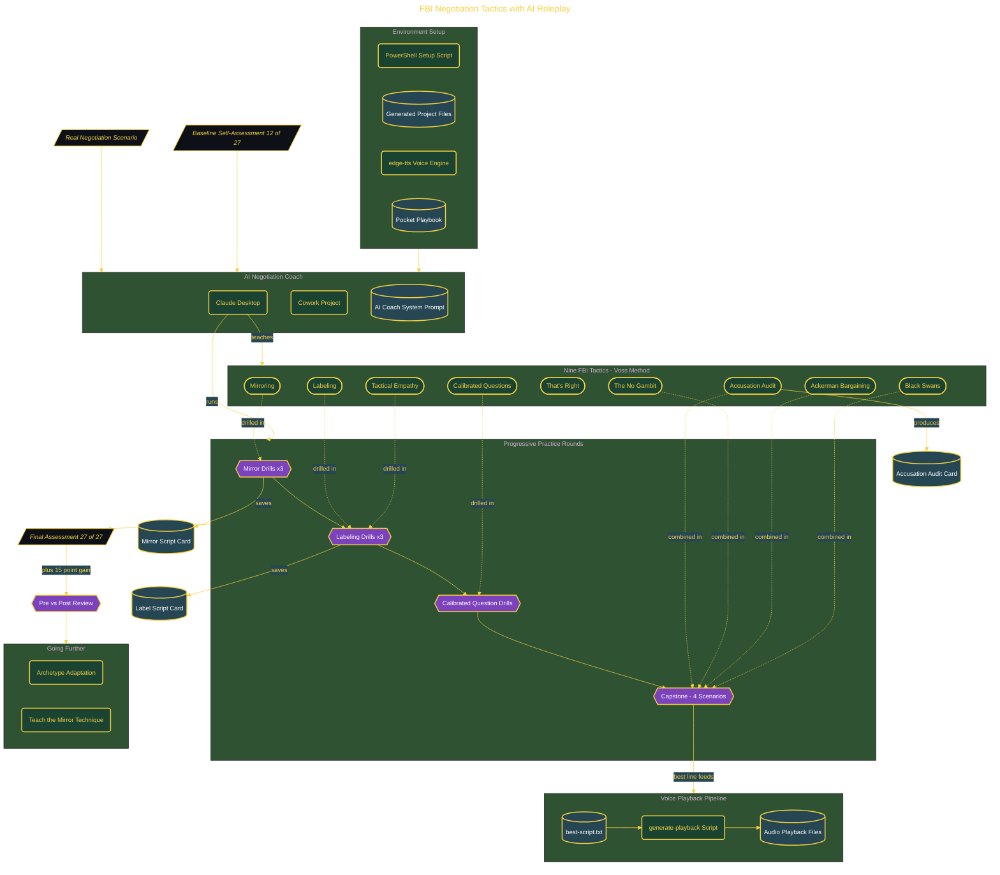

# FBI Negotiation Tactics with AI Roleplay

> Inside the [Applied Frameworks Systems Engineering](../../README.md) portfolio · *Frameworks from books and methodologies, engineered into working systems.*

## Overview

This project turns the FBI hostage-negotiation tactics from Chris Voss's Never Split the Difference into a repeatable, AI-coached rehearsal system for a real salary renegotiation. Across structured roleplay rounds it drills all nine tactics, scores each one before and after, and captures reusable script cards so the techniques hold under live pressure.

In this project, I prepared for an upcoming salary renegotiation by practicing FBI negotiation techniques through AI-powered roleplay. My objective was to build a structured approach that would help me communicate confidently while keeping the conversation collaborative instead of confrontational. Rather than relying on instinct during a high-pressure discussion, I wanted a repeatable framework that would allow me to stay composed regardless of how the conversation evolved.

Throughout the training, I focused on developing a calm delivery using the "late-night FM DJ" voice, sharpening my use of Mirroring and Labeling techniques, and learning how to respond to difficult situations with Calibrated Questions instead of immediate counter-offers. By repeatedly practicing realistic scenarios, I became more comfortable managing tension and maintaining control of the conversation while encouraging the other person to work toward a solution with me.

The architecture is built across **6 phases**, anchored by **Setting Up the Negotiation Coach** on the input side and **Going Further: Adaptation and Teaching** at the end. Each phase is listed in the Implementation section below.

## Architecture

The diagram shows the topology and data flow of the system as built. The full architectural narrative, with screenshots and prose, lives in [`documents/fbi-negotiation-ai-roleplay.md`](./documents/fbi-negotiation-ai-roleplay.md).

## Implementation

This system is built across **6 phases**:

1. **Setting Up the Negotiation Coach**
2. **Mastering the Mirror Technique Under Pressure**
3. **Labeling Emotions to Earn 'That's Right'**
4. **Using Calibrated Questions to Drive the Negotiation**
5. **Closing with No, Ackerman, and Black Swan Tactics**
6. **Going Further: Adaptation and Teaching**

For the full walkthrough with screenshots and step-by-step content, see [`documents/fbi-negotiation-ai-roleplay.md`](./documents/fbi-negotiation-ai-roleplay.md).

## Validation

Build outcomes verified end-to-end. Each phase below is captured with screenshots, configuration, and observable behavior in [`documents/fbi-negotiation-ai-roleplay.md`](./documents/fbi-negotiation-ai-roleplay.md):

- ✅ Setting Up the Negotiation Coach
- ✅ Mastering the Mirror Technique Under Pressure
- ✅ Labeling Emotions to Earn 'That's Right'
- ✅ Using Calibrated Questions to Drive the Negotiation
- ✅ Closing with No, Ackerman, and Black Swan Tactics
- ✅ Going Further: Adaptation and Teaching
