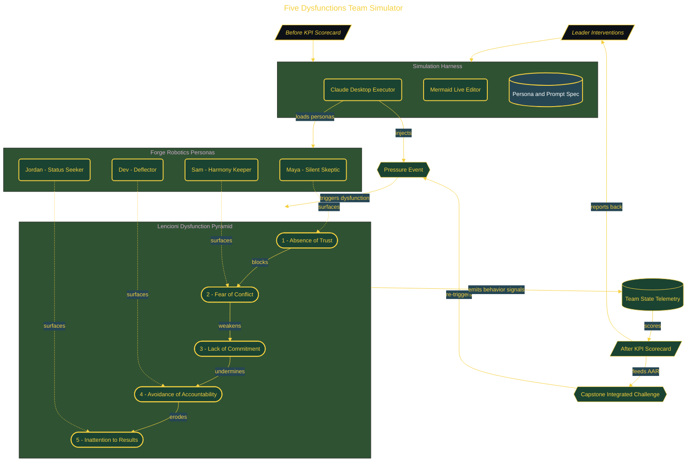

# Five Dysfunctions Team Simulator

> Inside the [Applied Frameworks Systems Engineering](../../README.md) portfolio · *Frameworks from books and methodologies, engineered into working systems.*

## Overview

-T-h-i-s- -p-r-o-j-e-c-t- -b-u-i-l-d-s- -a-n- -A-I---d-r-i-v-e-n- -s-i-m-u-l-a-t-o-r- -t-o- -o-p-e-r-a-t-i-o-n-a-l-i-z-e- -L-e-n-c-i-o-n-i-'-s- -F-i-v-e- -D-y-s-f-u-n-c-t-i-o-n-s- -m-o-d-e-l- -t-h-r-o-u-g-h- -c-o-n-t-r-o-l-l-e-d- -i-n-t-e-r-a-c-t-i-o-n- -w-i-t-h- -r-e-s-i-s-t-a-n-t- -p-e-r-s-o-n-a-s-.-
-
-I-n-s-t-e-a-d- -o-f- -p-a-s-s-i-v-e-l-y- -r-e-a-d-i-n-g- -t-h-e-o-r-y-,- -t-h-e- -s-y-s-t-e-m- -f-o-r-c-e-s- -r-e-a-l---t-i-m-e- -d-i-a-g-n-o-s-i-s- -a-n-d- -i-n-t-e-r-v-e-n-t-i-o-n- -a-c-r-o-s-s- -a-l-l- -f-i-v-e- -l-a-y-e-r-s- -o-f- -t-h-e- -d-y-s-f-u-n-c-t-i-o-n- -p-y-r-a-m-i-d-.- -E-a-c-h- -i-n-t-e-r-a-c-t-i-o-n- -i-s- -m-a-p-p-e-d- -t-o- -o-b-s-e-r-v-a-b-l-e- -b-e-h-a-v-i-o-r- -a-n-d- -t-h-e-n- -t-i-e-d- -t-o- -m-e-a-s-u-r-a-b-l-e- -b-u-s-i-n-e-s-s- -o-u-t-c-o-m-e-s-.- -T-h-e- -s-i-m-u-l-a-t-o-r- -c-r-e-a-t-e-s- -a- -c-l-o-s-e-d- -l-o-o-p- -w-h-e-r-e- -l-e-a-d-e-r-s-h-i-p- -a-c-t-i-o-n-s- -c-a-n- -b-e- -t-e-s-t-e-d-,- -e-v-a-l-u-a-t-e-d-,- -a-n-d- -r-e-f-i-n-e-d- -u-n-d-e-r- -p-r-e-s-s-u-r-e- -c-o-n-d-i-t-i-o-n-s- -t-h-a-t- -r-e-s-e-m-b-l-e- -r-e-a-l- -t-e-a-m- -d-y-n-a-m-i-c-s-.-

The architecture is built across **10 phases**, anchored by **Building an AI Team Effectiveness Simulator** on the input side and **Upward Accountability in a High Power-Distance Variant** at the end. Each phase is listed in the Implementation section below.

## Architecture

The diagram shows the topology and data flow of the system as built. The full architectural narrative, with screenshots and prose, lives in [`documents/five-dysfunctions-team-simulator.md`](./documents/five-dysfunctions-team-simulator.md).

## Implementation

This system is built across **10 phases**:

1. **Building an AI Team Effectiveness Simulator**
2. **Diagnosing Team Dysfunction: The Before KPI Scorecard**
3. **Building Vulnerability-Based Trust with Maya**
4. **Mining Productive Conflict with Sam**
5. **Driving Commitment Through Clarity and Buy-In**
6. **Delivering Peer Accountability Without Escalation**
7. **Focusing the Team on Collective Results**
8. **Capstone Meeting: All Five Layers Simultaneously**
9. **Before vs. After: Proving the KPI Movement**
10. **Upward Accountability in a High Power-Distance Variant**, -.

For the full walkthrough with screenshots and step-by-step content, see [`documents/five-dysfunctions-team-simulator.md`](./documents/five-dysfunctions-team-simulator.md).

## Validation

Build outcomes verified end-to-end. Each phase below is captured with screenshots, configuration, and observable behavior in [`documents/five-dysfunctions-team-simulator.md`](./documents/five-dysfunctions-team-simulator.md):

- ✅ Building an AI Team Effectiveness Simulator
- ✅ Diagnosing Team Dysfunction: The Before KPI Scorecard
- ✅ Building Vulnerability-Based Trust with Maya
- ✅ Mining Productive Conflict with Sam
- ✅ Driving Commitment Through Clarity and Buy-In
- ✅ Delivering Peer Accountability Without Escalation
- ✅ Focusing the Team on Collective Results
- ✅ Capstone Meeting: All Five Layers Simultaneously
- ✅ Before vs. After: Proving the KPI Movement
- ✅ Upward Accountability in a High Power-Distance Variant
