# Map Your Jagged Frontier with AI

> Inside the [Applied Frameworks Systems Engineering](../../README.md) portfolio · *Frameworks from books and methodologies, engineered into working systems.*

## Overview

This project builds a four-persona AI drill simulator based on the Co-Intelligence framework. The goal was to map my personal Jagged Frontier and identify where AI helped my work, where it needed supervision, and where it became unreliable.

The system turned AI use into a structured practice drill instead of a loose prompting exercise. Each phase required prediction, execution, verification, scoring, and reflection so the learning came from comparing what I expected against what the AI actually did.

This mattered because AI skill is not just knowing how to prompt. It is knowing when to trust, when to verify, and when the model has crossed from useful support into confident overreach.

The architecture is built across **7 phases**, anchored by **Building a Personal AI Mastery Drill from Scratch** on the input side and **Secret Mission: Operational Extensions and Two-Audience Walkthrough** at the end. Each phase is listed in the Implementation section below.

## Architecture

```mermaid
---
title: Map Your Jagged Frontier with AI
---
%%{init: {"theme":"base","themeVariables": {"primaryColor":"#1B4332","primaryTextColor":"#F4D03F","primaryBorderColor":"#F4D03F","secondaryColor":"#264653","tertiaryColor":"#2F5233","lineColor":"#F4D03F","fontFamily":"ui-monospace, SFMono-Regular, Menlo, Consolas, monospace","fontSize":"13px"}}}%%
flowchart LR
    classDef datastore fill:#264653,stroke:#F4D03F,stroke-width:2px,color:#FFFFFF
    classDef service fill:#1B4332,stroke:#F4D03F,stroke-width:2px,color:#F4D03F
    classDef event fill:#7B42BC,stroke:#F4D03F,stroke-width:2px,color:#FFFFFF
    classDef io fill:#0d1117,stroke:#F4D03F,stroke-width:1.5px,color:#F4D03F,font-style:italic

    subgraph Toolchain["Delivery Toolchain"]
        GitHubRepo[("GitHub: jagged-frontier-drill")]
        Linear(["Linear tickets: PS-38 to PS-43"])
        Obsidian(["Obsidian + Mermaid"])
        AIClient(["multi-turn AI client"])
    end

    subgraph Framework["Co-Intelligence Framework"]
        JaggedFrontier[/"Jagged Frontier map"/]
        CentaurMode[/"Centaur mode: handoff"/]
        CyborgMode[/"Cyborg mode: interleave"/]
    end

    subgraph Design["Design-Decision Record"]
        FivePrinciples[/"five foundational principles"/]
        ThreePatterns[/"three core patterns"/]
        FourMisreadings[/"four corrected misreadings"/]
    end

    subgraph Personas["Four-Persona Roster"]
        Coach(["Coach: gates prediction"])
        FrontierGuide(["Frontier Guide: judge"])
        Mirror(["Mirror: runtime output"])
        Challenger(["Challenger: catches drift"])
        ReAnchor{{"refusal rules + re-anchor cadence"}}
    end

    subgraph Patterns["Three Methodological Patterns"]
        PredictReveal{{"predict-then-reveal gate"}}
        JudgeVsRuntime[/"judge separated from runtime"/]
        BothModes[/"both Centaur and Cyborg required"/]
    end

    subgraph Simulator["Simulator Core"]
        BootPrompt[("boot prompt: turn protocol")]
        FiveScenarios[/"five profile scenarios"/]
        EightPhases(["eight timed phases: 60-minute drill"])
        CentaurScript(["Centaur handoff script"])
        CyborgScript(["Cyborg interleave script"])
    end

    subgraph Verify["Centaur vs Cyborg Verification"]
        CentaurVerify{{"Centaur: verify whole draft"}}
        CyborgVerify{{"Cyborg: verify at the seams"}}
    end

    subgraph Instruments["Instruments and Rubrics"]
        FrontierMap[("Frontier Map skeleton")]
        HypothesisWorksheet[("hypothesis worksheet")]
        SessionTranscript[("session transcript template")]
        FourRubrics[("four validation rubrics")]
        ReScore30[/"30-day re-score instrument"/]
        Adoption[/"daily check-in + adoption timeline"/]
    end

    subgraph Release["End-to-End Validation and Release"]
        PlainGuide[("plain-language guide README")]
        E2ERun(["full end-to-end scored run"])
        V1Tag[("v1.0.0 tag: commit da4c00a")]
    end

    subgraph Findings["Frontier Findings"]
        SubTask6[/"sub-task 6: predicted green, landed yellow"/]
        Overreach[/"Mirror asserted unproven operational readiness"/]
    end

    subgraph Proof["Linear-to-GitHub Proof Trail"]
        TicketToPR{{"ticket to PR to merge"}}
        ClosesPS{{"Closes PS-N drives state via webhook"}}
        WebhookTrail[("webhook timestamp event trail")]
        Phase3Seam[/"Secret Mission: Phase 3 scored 5 of 6, fix-forward"/]
    end

    Obsidian -- "renders" --> JaggedFrontier
    AIClient -- "runs" --> Personas
    GitHubRepo -- "version-controls" --> Simulator
    FivePrinciples -- "govern" --> ThreePatterns
    ThreePatterns -- "corrected by" --> FourMisreadings
    Design -- "defines" --> Personas

    Coach -- "requires before Mirror answers" --> PredictReveal
    FrontierGuide -- "diagnoses, not runs" --> JudgeVsRuntime
    Mirror -- "produces output under" --> JudgeVsRuntime
    Challenger -- "enforces" --> ReAnchor
    ReAnchor -- "keeps personas in role" --> Personas

    PredictReveal -- "prediction before prompt" --> Mirror
    BootPrompt -- "boots" --> Personas
    BootPrompt -- "seeds" --> FiveScenarios
    FiveScenarios -- "drive" --> EightPhases
    BootPrompt -- "structures" --> EightPhases
    EightPhases -- "handoff via" --> CentaurScript
    EightPhases -- "interleave via" --> CyborgScript
    CentaurScript -- "maps to" --> CentaurMode
    CyborgScript -- "maps to" --> CyborgMode
    BothModes -- "capstone fails if either missing" --> EightPhases

    CentaurMode -- "checked by" --> CentaurVerify
    CyborgMode -- "checked by" --> CyborgVerify
    CentaurVerify -- "scores into" --> FourRubrics
    CyborgVerify -- "scores into" --> FourRubrics
    FrontierMap -- "positions tasks on" --> JaggedFrontier
    HypothesisWorksheet -- "records prediction for" --> PredictReveal
    SessionTranscript -- "logs run into" --> FourRubrics
    FourRubrics -- "feed" --> ReScore30
    ReScore30 -- "sustained by" --> Adoption

    EightPhases -- "executed in" --> E2ERun
    PlainGuide -- "documents" --> E2ERun
    E2ERun -- "scores" --> SubTask6
    SubTask6 -- "surfaced" --> Overreach
    Overreach -- "removed before" --> V1Tag
    E2ERun -- "tagged as" --> V1Tag

    Linear -- "each step" --> TicketToPR
    TicketToPR -- "merge fires" --> ClosesPS
    ClosesPS -- "emits" --> WebhookTrail
    WebhookTrail -- "pins chain to" --> V1Tag
    E2ERun -- "seam exposed as" --> Phase3Seam
    Phase3Seam -- "fix-forward against" --> FourRubrics

    class GitHubRepo,BootPrompt,FrontierMap,HypothesisWorksheet,SessionTranscript,FourRubrics,PlainGuide,V1Tag,WebhookTrail datastore
    class Linear,Obsidian,AIClient,Coach,FrontierGuide,Mirror,Challenger,EightPhases,CentaurScript,CyborgScript,E2ERun service
    class ReAnchor,PredictReveal,CentaurVerify,CyborgVerify,TicketToPR,ClosesPS event
    class JaggedFrontier,CentaurMode,CyborgMode,FivePrinciples,ThreePatterns,FourMisreadings,JudgeVsRuntime,BothModes,FiveScenarios,ReScore30,Adoption,SubTask6,Overreach,Phase3Seam io
```

The diagram shows the topology and data flow of the system as built. The full architectural narrative, with screenshots and prose, lives in [`documents/jagged-frontier-drill.md`](./documents/jagged-frontier-drill.md).

## Implementation

This system is built across **7 phases**:

1. **Building a Personal AI Mastery Drill from Scratch**
2. **Configuring the Build Pipeline: Linear, GitHub, and Obsidian**
3. **Designing the System Architecture and Methodology**
4. **Building the Four-Persona Drill Simulator**
5. **Creating the Frontier Map, Rubrics, and Adoption Cadence**
6. **Running the Full Validation Pass and Tagging the Release**
7. **Secret Mission: Operational Extensions and Two-Audience Walkthrough**

For the full walkthrough with screenshots and step-by-step content, see [`documents/jagged-frontier-drill.md`](./documents/jagged-frontier-drill.md).

## Validation

Each build phase below is documented in [`documents/jagged-frontier-drill.md`](./documents/jagged-frontier-drill.md), with screenshots, configuration, and notes as captured during the build:

- ✅ Building a Personal AI Mastery Drill from Scratch
- ✅ Configuring the Build Pipeline: Linear, GitHub, and Obsidian
- ✅ Designing the System Architecture and Methodology
- ✅ Building the Four-Persona Drill Simulator
- ✅ Creating the Frontier Map, Rubrics, and Adoption Cadence
- ✅ Running the Full Validation Pass and Tagging the Release
- ✅ Secret Mission: Operational Extensions and Two-Audience Walkthrough
